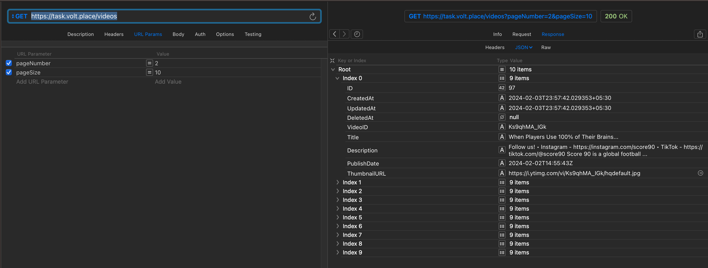

# YT API Microservice

Made for FamPay hiring task.

## Project Goal

To make an API to fetch latest videos sorted in reverse chronological order of their publishing date-time from YouTube for a given tag/search query in a paginated response.

## Basic Requirements:

- Server should call the YouTube API continuously in background (async) with some interval (say 10 seconds) for fetching the latest videos for a predefined search query and should store the data of vid eos (specifically these fields - Video title, description, publishing datetime, thumbnails URLs and any other fields you require) in a database with proper indexes.
- A GET API which returns the stored video data in a paginated response sorted in descending order of published datetime.
- It should be scalable and optimised.

## Tech Stack

1. Go
2. YouTube Data API v3
3. AWS Lambda
4. AWS EventBridge Rule
5. Postgres
6. Redis
7. SST

## Deployed Link

[https://task.volt.place/videos](https://task.volt.place/videos)

## Example Request

`GET /videos`

Returns a list of all videos in the database.

`GET /videos?pageSize=10&pageNumber=2`

Returns the paginated response corresponding to the URL parameters passed

## How To Run

1. Follow the instructions [here](https://docs.sst.dev/advanced/iam-credentials#loading-from-a-file) to setup AWS credentials locally.
2. Copy the .env.example file to .env and fill in the required details.
3. Run the db migrations using `go run migrate.go`
4. `pnpm install`
5. `pnpm dev`
